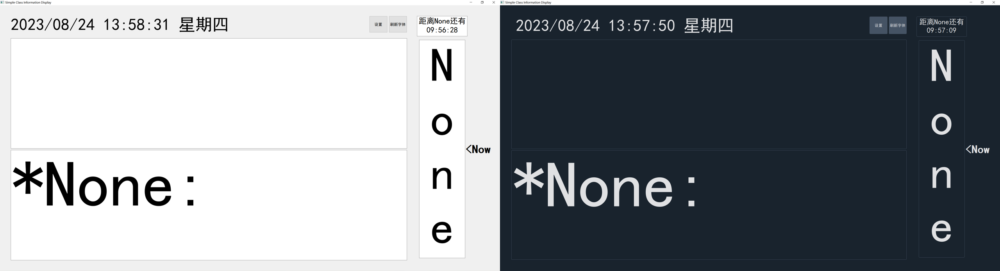

# Simple Class Information Display

> 如果无法正常访问仓库的[Github](https://gitee.com/erduotong/Simple_Class_Information_Display)
> 进行下载, 可以从仓库的[Gitee](https://gitee.com/erduotong/Simple_Class_Information_Display)进行下载

## 概述

这是一个信息展示的软件 针对在学校中的使用场景进行设计(如灵活调整, 自动生成) 减少一些枯燥的, 重复的工作

---

## 下载

### 选择qdarkstyle

程序有两种形式:有qdarkstyle和无qdarkstyle 请参见下图  
如果选择需要qdarkstyle(右图), 请在下载时选择带有 with_qdarkstyle 的(例如exe_with_qdarkstyle)  
如果选不需要qdarkstyle(左图), 请在下载时选择带有 without_qdarkstyle 的(例如source_without_qdarkstyle)

↓左侧: 无qdarkstyle

右侧: 有qdarkstyle↓

---

### 安装形式

* [从安装包安装](#从安装包安装) **(推荐)** 请优先选择
* [从程序压缩包安装]()
* [从源代码启动]()

#### 从安装包安装
